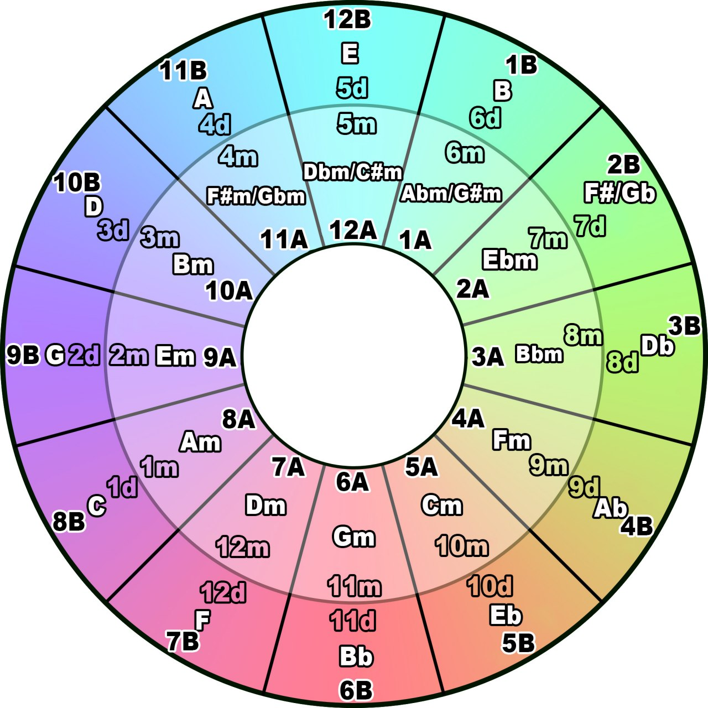

Пет-проект: Помощник для составления плейлистов, v.1.

# Проблема: 
У меня достаточно обширная библиотека хорошей музыки, но всю её сразу не запомнишь, а в плейлистах должно быть разнообразие. Плюс, музыка должна подходить по темпу, тональности и другим параметрам.

# Решение: 
Сделать сервис, который будет помогать мне подбирать музыку и сортировать плейлисты по темпу и тональности.

# Пользовательская составляющая
1. Плейлист составляется самостоятельно
2. Можно просматривать схожие треки, выбрав тональность на колесе камелота 
3. Есть рекомендации для добавления треков в плейлист на основе преобладающих тональностей в плейлисте

Пользовательский интерфейс должен содержать в себе распределение песен по тональностям колеса Камелота

# Техническая составляющая
- БД - Postgres или MariaDB. На текущем этапе не принципиально 
- Фронт делается на React отдельным проектом. Верстать на компонентах, стилизовать в процессе обучения. Про взаимодействие с API мне ещё предстоит узнать 
- Деплоится всё как один полноценный проект в контейнере Docker. Альтернативный ход событий - деплоймент фронта и бэка в разных контейнерах на 1 хост 
- API - без навороченной логики, только для отдачи джейсонов

# Возможности
- Можно найти сторонние апишники с музыкой, чтобы не заполнять библиотеку руками. Если не получится - можно сделать парсер Spotify или Я-Музыки
- Можно выкатить API на хост, а от API верстать на мобилку
- Можно настроить CI/CD и прорабатывать фронт прямо от хоста, на котором всегда будет актуальная версия бэка
- Потенциально можно использовать машинное обучение, чтобы натренировать программу миксовать как диджей. Можно взять хорошие плейлисты с YouTube, натренировать на таких выборках нейронные сети и дать сервису самому организовывать наборы треков. До уровня Яндекса явно не дойдёт, но если сосредотачивать аранжировки по выбранным пользователем трекам, то будет что-то новое 
- В теории, проект можно монетизировать, потому что на рынке всего 1 такой продукт (MixedInKey), который стоит 58$ в базовой версии, аддоны стоят примерно столько же

